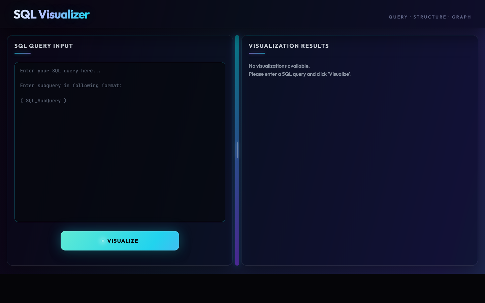

# SQL Visualizer

SQL Visualizer is a web app that turns SQL queries into **graphical diagrams** so you can see structure, joins, and flow more clearly. It targets developers, DBAs, and analysts who want to read and explain complex SQL faster.



## Features

- Web UI for entering one or more SQL statements and generating visualizations
- **Tables view** and **query view** images per query, with tabs when multiple queries are parsed
- Download of the current diagram image
- Resizable split between the SQL editor and the results pane

## Requirements

- **Python** 3.10+ (3.12 recommended)
- **Graphviz** installed on your system and available on your `PATH` (used to render graphs)

## Setup

### 1. Graphviz

Install Graphviz from the [official download page](https://graphviz.org/download/) and ensure the `dot` command works in a terminal (add Graphviz’s `bin` directory to your PATH if needed).

### 2. Python dependencies

From the project root:

```bash
python3 -m venv .venv
source .venv/bin/activate   # Windows: .venv\Scripts\activate
pip install -r requirements.txt
```

`requirements.txt` includes Flask, Pillow, sqlparse, and the Python `graphviz` package (bindings to the system Graphviz install).

## How to run

From the repository root:

```bash
python3 main.py
```

Then open a browser to:

- **http://127.0.0.1:5000/** — redirects to the main visualizer page  
- **http://127.0.0.1:5000/SQLViz** — same UI directly  

The dev server uses Flask’s built-in debugger; do not use this mode in production.

## How it works (high level)

1. Input is submitted from `SQLViz.html` to `auth.py`.
2. `SQL_parsing_module` parses the SQL into a structured representation.
3. For each parsed query, `structure_view.py` and `detail_view.py` build diagrams (via Graphviz).
4. Images are processed and returned as base64 in the response.
5. The template renders tabs and views from that payload.

## Project layout

| Path | Role |
|------|------|
| `main.py` | Starts the Flask app |
| `website/__init__.py` | App factory |
| `website/auth.py` | `/SQLViz` route, image pipeline |
| `website/views.py` | `/` redirect to visualizer |
| `website/templates/SQLViz.html` | Main UI |
| `website/static/` | Static assets |

## License

Add your license here if the project is published.
